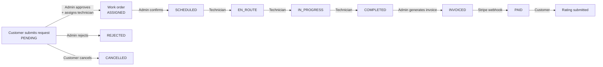
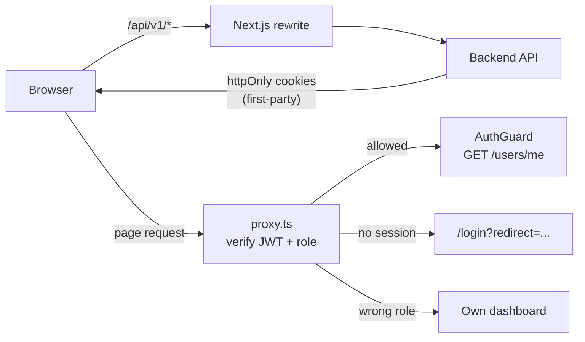
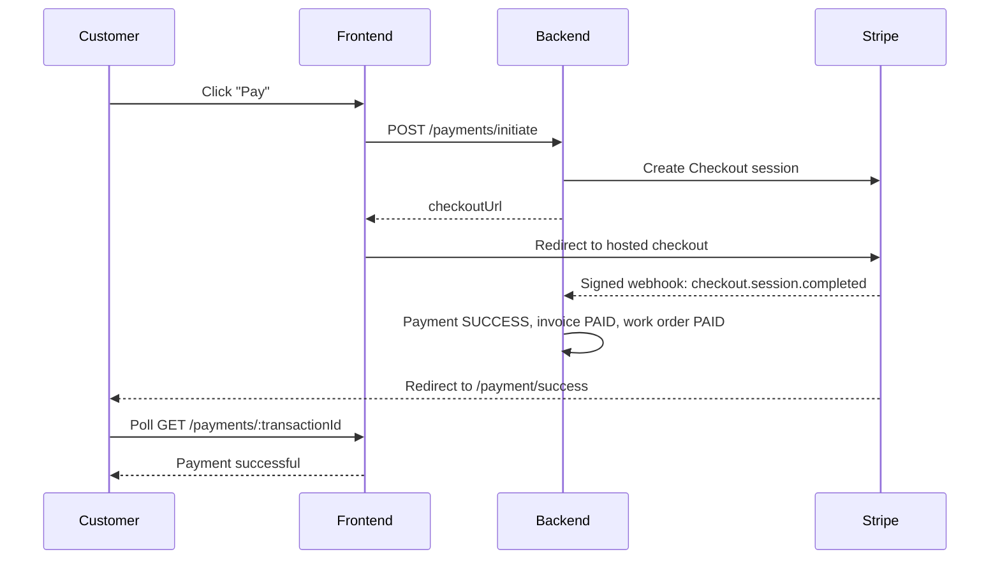

# FieldOps — Field Service Management Platform (Frontend)

> A production-grade Next.js frontend for managing on-site industrial service work — from a customer's
> first request, through skill-matched dispatch and on-site execution, to a Stripe-paid invoice and a rating.

FieldOps connects three groups of people around one shared workflow: **customers** who need equipment
serviced at their sites, **dispatchers (admins)** who review requests and schedule technicians, and
**technicians** who carry out the work. Every step is tracked, every status change is recorded, and
payment is confirmed only by Stripe's signed webhook.

This repository contains the **frontend**. The REST API lives in the
[FieldOps Backend](https://github.com/SuvraDebPaul/FieldOps-Backend) repository.

---

## Table of contents

1. [Live links](#live-links)
2. [Demo accounts](#demo-accounts)
3. [Key features](#key-features)
4. [The service workflow](#the-service-workflow)
5. [Pages and routes](#pages-and-routes)
6. [Tech stack](#tech-stack)
7. [Architecture](#architecture)
8. [Project structure](#project-structure)
9. [Getting started](#getting-started)
10. [Deployment](#deployment)
11. [Testing the full workflow](#testing-the-full-workflow)
12. [Design decisions and limitations](#design-decisions-and-limitations)
13. [Author](#author)

---

## Live links

| Resource              | Link                                                                                         |
| --------------------- | -------------------------------------------------------------------------------------------- |
| **Live frontend**     | [fieldops-frontend-gamma.vercel.app](https://fieldops-frontend-gamma.vercel.app)             |
| **Live API**          | [fieldops-backend.vercel.app/api/v1](https://fieldops-backend.vercel.app/api/v1/categories)  |
| **Frontend repo**     | [SuvraDebPaul/FieldOps-Frontend](https://github.com/SuvraDebPaul/FieldOps-Frontend)          |
| **Backend repo**      | [SuvraDebPaul/FieldOps-Backend](https://github.com/SuvraDebPaul/FieldOps-Backend)            |
| **API documentation** | [Postman documentation](https://documenter.getpostman.com/view/48414449/2sBYAxPUd2)          |
| **Demo video**        | _To be added_                                                                                |

---

## Demo accounts

The login page has **one-click demo buttons** for each role — no typing required.

| Role       | Email                    | Password      | Lands on      |
| ---------- | ------------------------ | ------------- | ------------- |
| Admin      | `admin@gmail.com`        | `Admin@12345` | `/admin`      |
| Customer   | `corp1@apextextiles.com` | `Admin@12345` | `/dashboard`  |
| Technician | `tech.rahim@gmail.com`   | `Admin@12345` | `/technician` |

**Stripe test card:** `4242 4242 4242 4242` · any future expiry date · any 3-digit CVC.

---

## Key features

### Customer

- **Sites management** — register every location where work is needed, with an on-site contact.
- **4-step request wizard** — Site → Service → Details → Review. The draft is persisted with Zustand, so
  a refresh or an accidental navigation never loses progress. Services can be pre-selected from the
  public catalog (`?categoryId=`).
- **Request tracking** — searchable, filterable list (status, priority) synced to the URL; edit or cancel
  while a request is still pending, with an **optimistic** cancel and automatic rollback on failure.
- **Live job tracking** — a status timeline built from the backend's history log, showing exactly when
  each stage was reached, who the technician is, the time actually spent on site and every part used.
- **Invoices and payments** — itemised invoices (labour from actual hours, parts, 15% VAT), an
  outstanding-balance summary, overdue highlighting, every payment attempt, and **Stripe Checkout**.
- **Ratings** — rate the technician (1–5 stars, accessible star input) once the invoice is paid.

### Technician

- **My jobs** — stat cards, **today's schedule** in time order, and the full job list (only their own
  jobs — enforced by the backend).
- **Guarded status workflow** — the job sheet offers only the next legal step
  (Start travelling → Arrived, start work → Complete job), mirroring the backend's state machine, with
  **optimistic updates**.
- **Parts logging** — record parts used, with a live line total, while en route or in progress.
- **Earnings and reviews** — labour billed per month (bar chart), paid vs billed, average rating and
  every customer review.

### Admin (dispatcher)

- **Operations overview** — pending requests, active jobs, jobs awaiting invoice, revenue collected,
  a monthly revenue chart, work orders by status, and the requests that have waited longest.
- **Request triage** — approve and assign a technician filtered by the **required skill and
  availability**, with the time slot pre-filled from the customer's preference and the job's estimated
  duration; reject with a reason; soft-delete.
- **Work order management** — confirm schedules, reschedule (duration preserved), cancel with a reason,
  and **generate invoices** from actual time on site.
- **Invoices** — all invoices across customers with payment attempts and outstanding balance.
- **User management** — search and filter by role/status, change roles (impossible options disabled),
  suspend or reactivate accounts (sessions are revoked immediately).
- **Service catalog** — create, edit and remove services; add skills.
- **Reports** — rating distribution, top technicians, and all customer feedback.

### Platform-wide

- Role-based route protection at **two layers** (edge proxy + session guard).
- Fully **responsive** — mobile drawer navigation, collapsible desktop sidebar (remembered across visits).
- **Skeleton loaders**, meaningful **empty states**, **toast notifications** for every API failure, and
  **error boundaries** at the root and inside each dashboard.
- **SEO metadata** and Open Graph tags on every public page.

---

## The service workflow



Each arrow is permitted for exactly one role. The frontend only shows the actions a role may take, and the
backend enforces the same rules on every request.

---

## Pages and routes

**28 routes**, all statically generated at build time.

| Area               | Route                     | Description                                            |
| ------------------ | ------------------------- | ------------------------------------------------------ |
| **Public**         | `/`                       | Home — live catalog, stats, workflow, top technicians  |
|                    | `/services`               | Service catalog with URL-synced search and skill filter |
|                    | `/services/[id]`          | Service detail, billing rules, qualified technicians   |
|                    | `/technicians`            | Technician directory — search, skill, availability, pagination |
|                    | `/about`                  | Platform guarantees and roles                          |
|                    | `/contact`                | Validated contact form and FAQ                         |
| **Authentication** | `/login`                  | Login with one-click demo accounts                     |
|                    | `/register`               | Customer registration with automatic sign-in           |
| **Customer**       | `/dashboard`              | Overview — status counts and recent requests           |
|                    | `/dashboard/requests/new` | Multi-step request wizard                              |
|                    | `/dashboard/requests`     | My requests (detail sheet via `?view=`)                |
|                    | `/dashboard/work-orders`  | Job tracking, invoice, payment, rating                 |
|                    | `/dashboard/sites`        | Sites management                                       |
|                    | `/dashboard/payments`     | Invoices and payment history                           |
|                    | `/dashboard/profile`      | Profile, avatar, password                              |
| **Technician**     | `/technician`             | My jobs, today's schedule, job actions                 |
|                    | `/technician/earnings`    | Earnings chart and reviews                             |
|                    | `/technician/profile`     | Profile and read-only work profile                     |
| **Admin**          | `/admin`                  | Operations overview with charts                        |
|                    | `/admin/requests`         | Request triage — approve, reject, delete               |
|                    | `/admin/work-orders`      | Confirm, reschedule, cancel, invoice                   |
|                    | `/admin/invoices`         | All invoices                                           |
|                    | `/admin/users`            | User management                                        |
|                    | `/admin/catalog`          | Services and skills                                    |
|                    | `/admin/reports`          | Ratings and technician performance                     |
|                    | `/admin/profile`          | Profile and password                                   |
| **Payment**        | `/payment/success`        | Webhook-confirmed payment result                       |
|                    | `/payment/cancel`         | Cancelled checkout with retry                          |
| **Utility**        | `not-found`, `error`, `global-error` | Custom 404 and error boundaries             |

---

## Tech stack

| Category              | Technology                                       | Purpose                                                      |
| --------------------- | ------------------------------------------------ | ------------------------------------------------------------ |
| Framework             | **Next.js 16.3** (App Router, Turbopack, React Compiler) | Routing, static generation, ISR, edge proxy           |
| Language              | **TypeScript 5** (strict, no `any`)              | End-to-end type safety mirroring the backend's Prisma models |
| UI                    | **React 19.2**                                   |                                                              |
| Styling               | **Tailwind CSS v4**                              | Utility-first, mobile-first styling                          |
| Components            | **shadcn/ui** on **Radix UI**                    | Accessible primitives (dialogs, sheets, selects, sidebar)    |
| Server state          | **TanStack Query 5**                             | Caching, invalidation, optimistic updates, polling           |
| Client state          | **Zustand 5** (+ `persist`, `devtools`)          | Sidebar state and the request-wizard draft                   |
| Forms and validation  | **TanStack Form 1** + **Zod 4**                  | Type-safe forms with rules mirroring the backend             |
| HTTP                  | **ofetch**                                       | API client with silent token refresh                         |
| Auth (edge)           | **jose**                                         | JWT verification inside `proxy.ts`                           |
| Charts                | **Recharts 3**                                   | Revenue, status, earnings and rating charts                  |
| Notifications         | **Sonner**                                       | Toasts for success and API failures                          |
| Icons and dates       | **lucide-react**, **date-fns**                   |                                                              |
| Payments              | **Stripe Checkout** (test mode)                  | Hosted checkout confirmed by a signed webhook                |
| Media                 | **Cloudinary** (via the backend)                 | Avatar storage, served through `next/image`                  |
| Tooling               | **Biome**, **pnpm**                              | Linting, formatting, package management                      |
| Hosting               | **Vercel**                                       | Frontend and backend deployment                              |

---

## Architecture

### Rendering strategy

| Area                                   | Strategy                                  | Why                                                       |
| -------------------------------------- | ----------------------------------------- | --------------------------------------------------------- |
| Home, Services, Service detail         | **SSG + ISR** (`revalidate = 3600`)       | Real catalog data in the HTML for speed and SEO; new services appear within an hour without a redeploy |
| Service detail pages                   | `generateStaticParams`                    | One pre-built page per category; `notFound()` for unknown IDs |
| About, Contact, Login, Register        | **Static**                                | Pure content and forms                                    |
| Technicians directory                  | Static shell + client fetching            | Server-side filtering and pagination change per visitor   |
| All dashboards                         | Static shell + TanStack Query             | Private, per-user data is fetched in the browser          |
| Private detail views                   | **Sheets driven by `?view=<id>`**         | No per-record routes to pre-build; the URL stays shareable and the back button closes the sheet |

Components are **Server Components by default**. Client Components are used only where the browser is
needed (state, effects, event handlers, `usePathname`, `useSearchParams`) — for example, the public
header is a Server Component containing three small client "islands".

### Authentication and route protection



1. **First-party cookies.** `next.config.ts` rewrites `/api/v1/*` to the backend, so the browser only ever
   talks to its own domain. The backend's `httpOnly` JWT cookies are therefore first-party (they work in
   Safari) and readable by the proxy. Tokens are never stored in JavaScript.
2. **`src/proxy.ts`** (Next.js 16's middleware) verifies the access token with `jose` and redirects by
   role **before** any page is served — an optimistic, cookie-only check.
3. **`AuthGuard`** confirms the session against `/users/me`, so a suspension or role change takes effect
   immediately. If the session is invalid it clears the cookies before redirecting, preventing redirect
   loops.
4. **Silent refresh.** `apiClient` catches a `401`, calls `/auth/refresh-token` once (parallel failures
   share a single refresh), and retries the original request.

### Data layer

```
Component ──► custom hook (TanStack Query) ──► API function ──► apiClient (ofetch) ──► /api/v1 rewrite ──► backend
   ▲                                                                                                      │
   └──────────────── cache · toast · redirect ◄──────────────── JSON + Set-Cookie ◄───────────────────────┘
```

- **API functions** (`src/api`) describe endpoints only — URL, method and response type.
- **Hooks** (`src/hooks`) own caching and side effects: query key factories, invalidation after
  mutations, optimistic updates with rollback, and `keepPreviousData` for flicker-free filtering.
- **Global error toasts** — any query or mutation declaring `meta.errorMessage` shows a toast on failure,
  configured once on the `QueryClient` and typed through TanStack Query's `Register` interface.
- **Retry policy** — 4xx responses are never retried; 5xx responses are retried up to twice.

### State management

| Kind of state        | Owner                         | Example                                         |
| -------------------- | ----------------------------- | ----------------------------------------------- |
| Server state         | **TanStack Query**            | Current user, requests, work orders, invoices   |
| URL state            | **`useSearchParams`** via a custom `useQueryParams` hook | Filters, search, pagination, open sheet |
| Global client state  | **Zustand**                   | Sidebar open/closed (`localStorage`), wizard step and draft (`sessionStorage`) |
| Local UI state       | **`useState`**                | Dialog open, password visibility                |

The logged-in user is deliberately **not** copied into Zustand — it stays in the TanStack Query cache so
it can never drift from the server. Persisted stores use `skipHydration` and rehydrate after mount to
avoid hydration mismatches on statically generated pages. The wizard draft is cleared on logout.

### Forms and validation

All forms use **TanStack Form + Zod**. Schemas mirror the backend's Zod rules so users see the same
messages the API would return. Notable patterns: per-step schemas for the wizard, role-aware profile
schemas, field listeners (the schedule end follows the start), `form.Subscribe` for live totals and
dirty-state buttons, and reusable field components (`TextField`, `PasswordField`, `TextareaField`,
`SelectField`, `RadioCardField`, `StarRatingField`).

### Payments



The frontend **never marks anything as paid**. Because Stripe may redirect the customer before its
webhook arrives, `/payment/success` polls the payment every two seconds until the backend confirms it,
with a timeout fallback. Cancelled checkouts offer a one-click retry.

### Error handling and loading states

- `loading.tsx` skeletons for every data route, plus Suspense skeletons for client-fetched sections.
- Meaningful empty states with a next action on every list.
- Root `error.tsx`, `global-error.tsx`, and **role-level error boundaries** that keep the dashboard
  sidebar usable when a single page fails.
- Custom `not-found.tsx`, also used by `notFound()` for unknown service IDs.

### Performance, accessibility and SEO

- Static generation and ISR for public pages; parallel data fetching with `Promise.all`.
- `next/image` for avatars (Cloudinary and Google domains allow-listed).
- React Compiler for automatic memoisation; narrow Zustand selectors and `useShallow`.
- Debounced search and `router.replace` so typing never floods history or the API.
- Keyboard-accessible controls, `aria-live` status updates, screen-reader tables behind every chart,
  native radio inputs behind the star rating.
- Metadata title template, per-page descriptions, Open Graph tags and `generateMetadata` for service pages.

---

## Project structure

```
src/
├── app/
│   ├── (public)/                 Home, about, contact, services, services/[id], technicians
│   ├── (authentication)/         Login, register
│   ├── (dashboard)/
│   │   ├── admin/                Overview, requests, work orders, invoices, users, catalog, reports, profile
│   │   ├── dashboard/            Customer overview, requests, wizard, work orders, sites, payments, profile
│   │   ├── technician/           Jobs, earnings, profile
│   │   └── payment/              Stripe success and cancel pages
│   ├── layout.tsx · error.tsx · global-error.tsx · not-found.tsx · globals.css
├── api/                          Endpoint functions, one file per backend module
├── hooks/                        TanStack Query hooks and custom hooks
├── components/
│   ├── ui/                       shadcn/ui primitives
│   ├── shared/                   DataTable, StatusBadge, StatCard, SearchInput, charts, skeletons…
│   ├── form/                     Login, register, contact forms and reusable field components
│   ├── auth/ · dashboard/ · layout/
│   └── modules/                  Feature components (admin, requests, request-wizard, work-orders, payments…)
├── stores/                       Zustand stores
├── providers/                    QueryClient, tooltips, store hydration
├── types/                        Types mirroring the backend's Prisma models
├── validation/                   Zod schemas
├── constants/ · routes/ · utils/ · lib/
└── proxy.ts                      Role-based route protection
```

---

## Getting started

### Prerequisites

- **Node.js 22+** and **pnpm**
- The [FieldOps backend](https://github.com/SuvraDebPaul/FieldOps-Backend) running locally on port 5000
  (with `FRONTEND_URL=http://localhost:3000`)
- The [Stripe CLI](https://docs.stripe.com/stripe-cli) for testing payments locally

### Installation

```bash
git clone https://github.com/SuvraDebPaul/FieldOps-Frontend.git
cd FieldOps-Frontend
pnpm install
cp .env.example .env.local
```

### Environment variables

| Variable            | Required | Description                                                                 |
| ------------------- | -------- | --------------------------------------------------------------------------- |
| `BACKEND_URL`       | Yes      | Backend origin (no `/api/v1`). Used by the rewrite and by build-time static generation. |
| `JWT_ACCESS_SECRET` | Yes      | **Identical** to the backend's value, so `proxy.ts` can verify access tokens. |
| `SITE_URL`          | Yes      | Public URL of this frontend, used as `metadataBase` for SEO and Open Graph.  |

All variables are server-only — nothing is exposed to the browser.

### Run

```bash
pnpm dev
```

Open http://localhost:3000. To test payments, forward Stripe webhooks to the backend in another terminal:

```bash
stripe listen --events checkout.session.completed,checkout.session.expired,checkout.session.async_payment_failed --forward-to localhost:5000/api/v1/payments/webhook
```

### Scripts

| Command          | Description                                      |
| ---------------- | ------------------------------------------------ |
| `pnpm dev`       | Development server                               |
| `pnpm build`     | Production build (requires the backend to be reachable) |
| `pnpm start`     | Serve the production build                       |
| `pnpm typecheck` | Generate route types and run the TypeScript compiler |
| `pnpm lint`      | Biome lint and format check                      |
| `pnpm format`    | Format with Biome                                |

---

## Deployment

The frontend and backend are deployed separately on **Vercel**. Order matters, because the frontend's
build fetches the catalog from the backend:

1. **Backend** — deploy with `NODE_ENV=production` (enables `Secure` cookies) and its own variables.
2. **Frontend** — import this repository and set `BACKEND_URL`, `JWT_ACCESS_SECRET` and `SITE_URL`.
3. **Backend** — set `FRONTEND_URL` to the frontend's URL (Stripe redirects there) and redeploy.
4. **Stripe** — add a webhook endpoint pointing directly at
   `https://fieldops-backend.vercel.app/api/v1/payments/webhook` for the three `checkout.session.*` events
   (snapshot payload), set its signing secret as the backend's `STRIPE_WEBHOOK_SECRET`, and redeploy.

---

## Testing the full workflow

The complete lifecycle across all three roles, entirely through the UI:

1. **Customer** — add a site, then submit a request with the wizard (`SR-…`, *Pending review*).
2. **Admin** — approve it, assign a qualified technician and a time slot (`WO-…`, *Assigned*), then
   **Confirm schedule**.
3. **Technician** — Start travelling → Arrived, start work → log a part → Complete job.
4. **Admin** — **Generate invoice** (`INV-…`) from the actual time on site, parts and VAT.
5. **Customer** — pay with `4242 4242 4242 4242` and watch the success page confirm via the webhook.
6. **Customer** — rate the job; the technician's public rating updates.
7. **Admin** — the revenue chart and *Revenue collected* include the new payment.

---

## Design decisions and limitations

- **Technician availability and rates are read-only for technicians.** They are managed by the
  dispatcher in the backend, so the technician profile displays them without an edit form.
- **Dashboard analytics are computed from the most recent 100 records** (the API's maximum page size).
  This is ample for the project; at scale, a dedicated aggregation endpoint would replace it.
- **Catalog changes reach public pages on the next revalidation** (within an hour) — the trade-off for
  serving those pages as static HTML. Dashboards update immediately through cache invalidation.
- **Removing a service soft-deletes it** — existing requests and work orders keep their history.

---

## Author

**Suvra Deb Paul** — [GitHub @SuvraDebPaul](https://github.com/SuvraDebPaul)

Built as the B7A7 frontend assignment (Field Service Management), on top of the B7A6 FieldOps backend.
